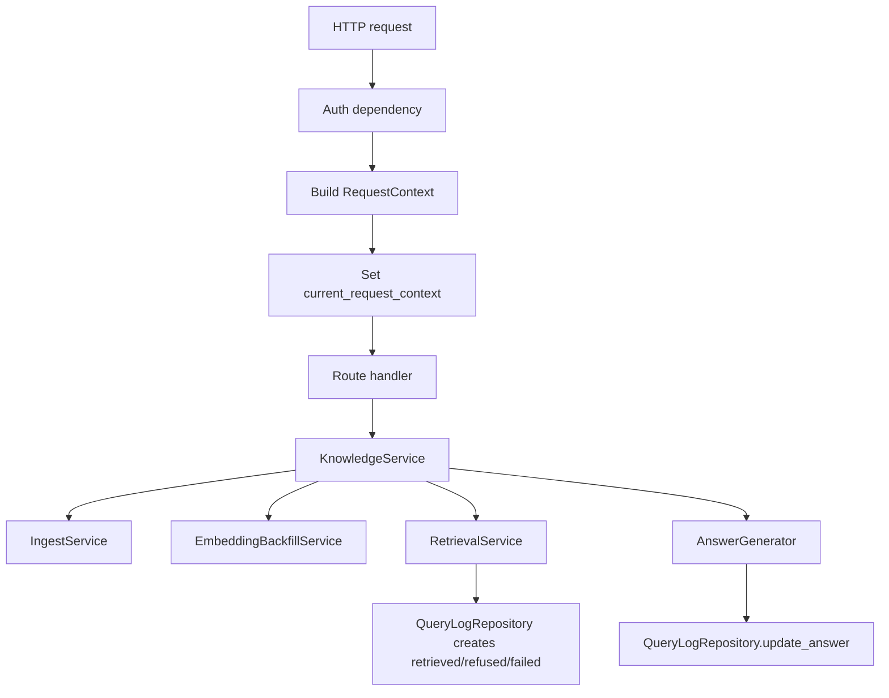

# M5 Knowledge API 与测试台设计 Spec

## 背景与目标

M5 的目标是把 M2 的导入链路、M3 的 embedding / vector store 能力、M4 的检索链路组合成可被上层应用安全调用的 Knowledge API，并提供一个最小测试控制台用于上传文档、调试检索、查看 references、验证拒答和可选答案生成。

M5 的范围严格限定在"服务 API 与调试测试台"这一层：

- M5 **负责** HTTP API、鉴权入口、`RequestContext` 注入、请求 schema 校验、文档上传落临时文件、调用 `IngestService`、触发或暴露 embedding backfill、调用 `RetrievalService`、返回 context / references / hit summary、可选答案生成、query log answer 回写、最小控制台页面。
- M5 **不负责** ChunkFlow 解析细节、embedding provider 内部实现、pgvector SQL、reranker 排序逻辑、parent expansion、context assembly、references 编号生成。这些分别由 M2、M3、M4 接管。
- M5 **不引入**内置 Agent Runtime，不实现工具调用、规划、记忆、长任务编排或业务工作台。上层 Agent 平台只能通过 M5 API 调用知识能力，不得持有数据库、向量库或 `VectorStoreAdapter` 句柄。
- M5 **不绕过** M4 检索链路。所有检索、上下文和问答测试都必须经过 `RetrievalService.retrieve()`，从而完整执行服务端权限 filter、query embedding、vector recall、rerank、parent expansion、references 组装和拒答判定。
- M5 **不硬编码** LLM 厂商或模型名。答案生成是可选调试能力，LLM provider、model、endpoint、API key、timeout 和重试均来自配置或依赖注入。

设计优先级继续遵循 RecallForge 的北极星：召回质量、引用可追溯、权限隔离和可诊断性优先于吞吐。M5 可以接受初版导入和回填较慢，但不能接受请求体覆盖凭证身份、越权 filters、无引用答案、跳过 rerank / parent expansion 或不可复盘的回答。

## 交付物清单

| 交付物 | 优先级 | 来源拆解 | M5 验收口径 |
| --- | --- | --- | --- |
| HTTP 应用入口 | P0 | ROADMAP M5 | `recallforge/api/app.py` 提供 FastAPI app factory，统一注册 knowledge、rag alias、console、health 路由 |
| 鉴权与 `RequestContext` 注入 | P0 | AGENTS.md 请求上下文与权限传递 | Bearer JWT / 受限 API Key 解析出 `tenant_id`、`user_id`、`department`、`access_level`、`request_id`，注入 `current_request_context`，请求体不能覆盖 |
| API schema 白名单 | P0 | AGENTS.md API 初版边界 | Pydantic schema `extra="forbid"`；用户请求体不暴露 `tenant_id`、`user_id`、`department`、`access_level`、`status` |
| `POST /api/knowledge/documents` | P0 | ROADMAP M5 | 上传文档并调用 `IngestService.ingest_document()`；返回 `document_id`、`job_id`、`status`、`embedding_status` |
| 导入任务查询 API | P1 | ROADMAP M5 测试台 | `GET /api/knowledge/ingest-jobs/{job_id}` 只按当前 `tenant_id` 查询任务状态，用于测试台刷新 |
| embedding 回填衔接 | P0 | M3 / M5 端到端问答 | 导入成功后可按配置触发 `EmbeddingBackfillService.backfill()`；不直接写向量列，不直接调用 provider 生成文档 embedding |
| `POST /api/knowledge/retrieve` | P0 | ROADMAP M5 | 调用 M4 `RetrievalService.retrieve()`，返回 status、references、hit summary、refusal、trace id，不返回答案 |
| `POST /api/knowledge/context` | P0 | ROADMAP M5 | 调用同一检索链路，返回已组装 `context_text`、references、trace id；拒答时不返回伪上下文 |
| `POST /api/knowledge/answer` | P0 | ROADMAP M5 | 可选问答测试接口；只基于 M4 组装的 context 生成答案；证据不足时返回明确拒答；成功后回写 query log |
| `/api/rag/documents` alias | P0 | AGENTS.md API 初版边界 | 与 `/api/knowledge/documents` 使用同一 handler，不产生第二套导入逻辑 |
| `/api/rag/query` alias | P0 | AGENTS.md API 初版边界 | 请求体只接收 `question` 与白名单 `filters`；返回 `answer` 与 `references` |
| 答案生成提示词与校验 | P0 | AGENTS.md 引用约束 | prompt 要求只使用 context 与 references；引用只能来自 `[1]`、`[2]` 等既有编号；输出引用校验失败时拒绝或修复一次 |
| 最小测试控制台 | P1 | ROADMAP M5 | 提供上传、任务状态、问题输入、答案、references、命中 chunk、拒答原因展示；不承载业务工作台或 Agent 逻辑 |
| 端到端 smoke test | P0 | ROADMAP M5 | 使用 fake auth / fake embedding / fake reranker / fake answer generator 完成上传、回填、问答、references 返回 |
| 安全与边界扫描测试 | P0 | AGENTS.md 不可破坏约束 | API 层不能直接调用 `VectorStoreAdapter.search()`、不能 import `PgVectorStore` 到 route handler、不能接受越权身份字段 |

优先级说明：P0 是上层应用安全接入的最低闭环，必须随 M5 完成；P1 是测试台和可用性增强，可以同批落地，但不得影响 P0 的安全边界。

## 设计约束

下列约束作为 M5 评审清单：

- API 入口必须先鉴权，再创建 `RequestContext`。没有有效凭证时不得进入 ingest、retrieval、answer 或 console API。
- `tenant_id`、`user_id`、`department`、`access_level` 只能来自凭证 claims、服务端会话或受限 API Key 绑定策略。请求体里的同名字段一律拒绝，不能覆盖凭证身份。
- 客户端 `filters` 只允许业务字段：`doc_type`、`source_uri`、`version`、`date_range`。`tenant_id`、`department`、`access_level`、`status`、`user_id`、`embedding_model` 等字段直接拒绝并写审计日志。
- `/api/knowledge/retrieve`、`/api/knowledge/context`、`/api/knowledge/answer` 和 `/api/rag/query` 都必须调用 `RetrievalService.retrieve()`，不得直接调用 `EmbeddingProvider.embed_query()`、`VectorStoreAdapter.search()`、`PgVectorStore` 或 repository FTS 查询。
- 文档导入 API 只调用 `IngestService.ingest_document()`，不得在 API 层重新调用 `parse_to_chunk_package()` 或直接写 parent / child chunk。
- 上传后若触发 embedding 回填，必须调用 `EmbeddingBackfillService.backfill()`，由该服务通过 `VectorStoreAdapter.upsert_chunks()` 写向量。M5 不直接写 pgvector 列。
- 答案生成只消费 `RetrievalResult.context_text` 和 `RetrievalResult.references`。没有 references、拒答或低置信度时不得调用 LLM 强答。
- 答案中的引用只能使用 M4 `ReferenceBuilder` 已分配的编号。M5 需要在返回前校验引用编号集合，发现发明引用时拒绝或进行一次受控修复。
- M5 query log 成功答案回写只使用 `QueryLogRepository.update_answer(request_id, tenant_id, answer)`，将 M4 的 `retrieved` 状态更新为 `success`。不得新建第二条 query log 伪造成功状态。
- M5 不能把完整跨租户上下文写入日志。API 日志只记录 request id、tenant id、状态、耗时、命中摘要、错误类别和必要诊断。
- 测试控制台只是知识底座调试面，不允许保存用户 token 到持久化浏览器存储，不允许展示或修改服务端权限字段。
- 上层应用或 Agent 平台只能通过 M5 API 获取检索、context、references 或答案。M5 不暴露 `VectorStoreAdapter`、repository、数据库 URL 或 embedding provider 给外部调用方。

## 技术选型与新增依赖

M5 推荐使用 FastAPI 作为 HTTP 层，原因是项目已使用 Pydantic v2，FastAPI 对 request / response schema、multipart 上传、依赖注入和测试客户端支持较直接。

建议新增依赖：

| 依赖 | 用途 | 备注 |
| --- | --- | --- |
| `fastapi` | HTTP API 与 OpenAPI schema | 仅作为 API 层框架，不进入 retrieval / storage 层 |
| `uvicorn[standard]` | 本地开发服务器 | 生产部署可替换 ASGI server |
| `python-multipart` | 文件上传 | `POST /api/knowledge/documents` multipart |
| `PyJWT` 或 `python-jose` | JWT 验签 | 选一个即可，封装在 `recallforge/api/auth.py` |

现有 `httpx` 可复用于 API 测试和可选 LLM HTTP 调用。M5 不要求引入前端构建工具；最小控制台可以是 `recallforge/console/static/index.html`、`app.js`、`style.css`，由 FastAPI StaticFiles 暴露。

## 配置项

M5 在 `recallforge/config.py` 中新增或确认以下配置。所有默认值必须显式，不能静默落到错误模型或错误权限策略。

| 字段 | 建议默认值 | 用途 |
| --- | --- | --- |
| `api_enabled` | `True` | 是否启用 HTTP API app |
| `api_title` | `RecallForge Knowledge API` | OpenAPI 标题 |
| `api_jwt_issuer` | `""` | JWT issuer 校验；为空时本地测试可跳过 issuer 校验 |
| `api_jwt_audience` | `""` | JWT audience 校验；为空时本地测试可跳过 audience 校验 |
| `api_jwt_public_key` | `""` | JWT 公钥或共享密钥，生产必须配置 |
| `api_service_keys` | `""` | 受限 API Key 映射配置，推荐 JSON 或 secret 引用 |
| `api_require_auth` | `True` | 生产必须为 `True`；测试可显式关闭并注入 fake context |
| `api_request_id_header` | `X-Request-Id` | 透传或生成 request id |
| `api_cors_allowed_origins` | `""` | 逗号分隔白名单，默认不开放跨域 |
| `api_docs_enabled` | `False` | 是否暴露 Swagger UI / ReDoc；开发环境可开启，生产默认关闭 |
| `api_openapi_enabled` | `True` | 是否暴露 `/openapi.json`；生产可关闭或要求鉴权 |
| `console_enabled` | `False` | 是否启用最小测试控制台；生产默认关闭 |
| `upload_temp_dir` | `.tmp/uploads` | 上传临时目录，必须位于项目可写目录或显式配置目录 |
| `upload_cleanup_enabled` | `True` | ingest 结束后删除临时文件 |
| `upload_startup_cleanup_enabled` | `True` | 启动时清理超过 TTL 的遗留临时文件 |
| `upload_temp_ttl_seconds` | `86400` | 临时上传文件保留上限，默认 24 小时 |
| `ingest_max_file_bytes` | `104857600` | 单文件上传上限，默认 100 MiB，与现有配置保持一致 |
| `auto_embedding_backfill_on_ingest` | `True` | 导入成功后是否自动回填当前 embedding 模型 |
| `ingest_backfill_limit` | `20000` | 单文档自动回填最大 chunk 数，不能超过 `ingest_max_child_chunks_per_document` |
| `answer_generation_enabled` | `False` | 是否启用可选答案生成 |
| `llm_provider` | `""` | 答案生成 provider 标识，业务代码不得硬编码厂商 |
| `llm_model` | `""` | 答案生成模型名，由配置注入 |
| `llm_endpoint` | `""` | LLM HTTP endpoint |
| `llm_api_key` | `""` | LLM API key；可回退到通用 secret，但必须显式记录 provider / model |
| `llm_request_timeout_seconds` | `60.0` | LLM 请求超时 |
| `llm_max_retries` | `2` | LLM 临时错误重试次数 |
| `answer_max_tokens` | `2048` | 答案生成最大输出 token |
| `answer_temperature` | `0.0` | 测试台默认低随机性 |
| `answer_validate_citations` | `True` | 是否校验答案引用编号 |
| `answer_repair_invalid_citations` | `True` | 引用校验失败时是否进行一次修复尝试 |

生产启动时必须执行 preflight：

1. API auth 配置可用，生产环境 `api_require_auth=True`。
2. embedding provider、vector column、reranker preflight 继承 M3 / M4 规则。
3. `auto_embedding_backfill_on_ingest=True` 时，embedding provider 必须可用。
4. `answer_generation_enabled=True` 时，LLM provider、model、endpoint、API key 必须可用。
5. CORS 白名单为空或合法，不允许生产默认 `*`。
6. `api_docs_enabled=True` 的生产部署必须确认仅内网或鉴权后可访问。
7. `upload_temp_dir` 可写，且启动清理不会越过该目录边界。

## OpenAPI 文档

FastAPI 自动生成 OpenAPI schema，但 M5 对文档质量有最低要求：

- 每个 endpoint 必须有 `tags`、`summary`、简短 `description` 和至少一个 request / response example。
- `/openapi.json` 默认可生成；生产是否暴露由 `api_openapi_enabled` 控制。若生产暴露，必须与 API 使用同一鉴权层或仅在内网网段可访问。
- Swagger UI / ReDoc 默认关闭，由 `api_docs_enabled` 控制；开发环境可开启，生产默认关闭。
- OpenAPI examples 不得包含真实 tenant、真实文档内容、API key、JWT 或 provider secret。
- `/api/rag/*` alias endpoint 的 description 必须说明其兼容用途，并指向 `/api/knowledge/*` 的主接口语义。

## 模块设计

### 目录结构

```text
recallforge/
  api/
    __init__.py
    app.py                    # FastAPI app factory、startup preflight、router 注册
    auth.py                   # JWT / API Key 鉴权、RequestContext 构造
    context.py                # HTTP dependency：current_request_context set/reset
    dependencies.py           # Settings、session、provider、service factory
    schemas.py                # Pydantic request/response schema
    errors.py                 # HTTP error mapping
    knowledge_service.py      # API 编排服务，调用 ingest/backfill/retrieval/answer
    answering.py              # AnswerGenerator protocol 与默认实现/registry
    routes/
      __init__.py
      health.py               # /healthz、/readyz
      knowledge.py            # /api/knowledge/*
      rag.py                  # /api/rag/* alias
      console.py              # /console 静态资源
  console/
    static/
      index.html
      app.js
      style.css
tests/
  test_m5_auth_context.py
  test_m5_api_schemas.py
  test_m5_knowledge_service.py
  test_m5_answer_generation.py
  test_m5_api_routes.py
  test_m5_console_static.py
  test_m5_boundary_scan.py
  e2e/test_m5_knowledge_api_smoke.py
```

M5 不要求新增数据库迁移。它复用 M1-M4 已有表：`rag_documents`、`rag_parent_chunks`、`rag_chunks`、`rag_ingest_jobs`、`rag_query_logs`。如果后续需要持久化 API Key、上传文件或后台任务状态，应进入 M7 稳定化或单独 ADR。

### 请求链路



关键边界：

- Route handler 只做 schema、dependency 和 response 序列化，不包含业务流程。
- `KnowledgeService` 是 M5 编排层，可以调用 M2 / M3 / M4 的公开服务入口，但不能调用它们的内部方法。
- `RetrievalService` 仍是检索唯一入口。M5 不复制 filter builder、rerank、parent expansion、reference builder 逻辑。
- `current_request_context` 在请求结束后必须 reset，避免 async worker 之间串号。

## 鉴权与请求上下文

### `RequestContext` 来源

M5 使用 M4 已定义的类型：

```python
@dataclass(frozen=True)
class RequestContext:
    tenant_id: str
    user_id: str
    department: str
    access_level: str
    request_id: uuid.UUID = field(default_factory=uuid.uuid4)
```

JWT claims 推荐映射：

| claim | `RequestContext` 字段 | 说明 |
| --- | --- | --- |
| `tenant_id` 或 `tid` | `tenant_id` | 必填 |
| `sub` 或 `user_id` | `user_id` | 必填，服务 API Key 可映射为服务账号 |
| `department` | `department` | 必填，缺失时拒绝或由服务端会话补齐 |
| `access_level` | `access_level` | 必填，必须在闭合枚举内 |
| `jti` / header `X-Request-Id` | `request_id` | 可选；缺失时服务端生成 UUID |

受限 API Key 不直接把 key 内容当身份字段。M5 需要把 key 映射到服务端配置中的固定权限：

```json
{
  "key_id": "ingest-worker",
  "tenant_id": "tenant-a",
  "user_id": "svc-ingest-worker",
  "department": "global",
  "access_level": "restricted",
  "scopes": ["documents:write", "knowledge:read"]
}
```

API Key 只允许执行其 scopes 覆盖的 endpoint。比如只具有 `documents:write` 的 key 不能调用 `/api/knowledge/answer`。

Scope 枚举必须固定，不能由 route handler 自行发明字符串：

| Scope | 允许 endpoint | 说明 |
| --- | --- | --- |
| `documents:write` | `POST /api/knowledge/documents`、`POST /api/rag/documents` | 上传并导入文档；是否自动 backfill 仍由服务端配置决定 |
| `documents:read` | `GET /api/knowledge/ingest-jobs/{job_id}` | 查询当前 tenant 下导入任务状态 |
| `knowledge:read` | `POST /api/knowledge/retrieve`、`POST /api/knowledge/context` | 获取检索结果、references、hit summary 或组装 context，不生成答案 |
| `knowledge:answer` | `POST /api/knowledge/answer`、`POST /api/rag/query` | 基于 RecallForge context 生成问答测试答案 |
| `console:use` | `GET /console`、`GET /console/*` | 访问最小测试控制台页面；页面内 API 调用仍需对应业务 scope |

JWT 用户也使用同一套 scope 语义。若业务身份系统没有显式 scopes，M5 auth 层必须把角色映射为上述 scopes，并把映射逻辑集中在 `recallforge/api/auth.py`。

### 上下文注入

HTTP dependency 负责：

1. 验证 Bearer token 或 API Key。
2. 构造 `RequestContext`。
3. `token = current_request_context.set(ctx)`。
4. `yield ctx` 给 route handler。
5. 请求结束后 `current_request_context.reset(token)`。

任何 API service 如果发现 `current_request_context.get()` 为 `None`，必须返回 500 并记录配置错误。测试可以显式注入 fake context，但不能让生产 handler 在无 context 状态下继续。

### 请求体身份字段拒绝

所有 request schema 使用 `model_config = ConfigDict(extra="forbid")`。此外，M5 需要对嵌套 `filters` 和 `metadata` 做 forbidden key 扫描。

禁止字段：

```text
tenant_id
user_id
department
access_level
status
embedding_model
embedding_provider
embedding_dim
reranker_model
reranker_provider
```

请求体出现这些字段时：

- 返回 `400 Bad Request`。
- 错误码为 `forbidden_request_field`。
- 记录审计日志：request id、tenant id、user id、field、endpoint、remote address。
- 不调用 `IngestService`、`EmbeddingBackfillService`、`RetrievalService` 或 `AnswerGenerator`。

## API Schema

### 通用类型

```python
class BusinessFilters(BaseModel):
    model_config = ConfigDict(extra="forbid")

    doc_type: str | None = None
    source_uri: str | None = None
    version: int | None = None
    date_range: DateRangeFilter | None = None
```

`date_range` 是 M4 预留字段，M5 可以透传给 `RetrievalRequest.client_filters`，但当前不会实际影响 `rag_chunks` 查询。只要 request 包含 `date_range`，response 必须在 `metadata.warnings` 中追加 `date_range_filter_ignored`，并在 `metadata.date_range_filter_ignored=true` 标记。调用方看到该 warning 时只能把结果视为"未按日期收窄的召回结果"，不能把它当作满足日期过滤的答案依据。

```python
class ReferenceResponse(BaseModel):
    ref_id: str
    index: int
    document_id: int
    document_title: str | None
    document_updated_at: datetime | None
    chunk_id: int
    chunk_key: str
    parent_id: int
    parent_key: str
    source_uri: str
    doc_type: str
    page_start: int | None
    page_end: int | None
    heading_path: list[str] | None
    version: int
    rerank_score: float
    vector_score: float
    child_chunks: list[ReferenceChildResponse]
```

`document_updated_at` 不是 M4 `Reference` 当前字段，M5 将它标为 P1 展示字段。初版允许返回 `null`；若实现 enrichment，必须在 `KnowledgeService` 中按 `document_id` 集合批量调用一次 `DocumentRepository.get_by_ids(ctx.tenant_id, ids)`，不得按 reference 逐条查询造成 N+1。该查询只读取当前 tenant 文档元数据，不触碰向量或检索逻辑。后续也可以把 `document_updated_at` 扩展进 M4 `Reference`，但不能改变 M4 references 编号来源。

```python
class HitSummaryResponse(BaseModel):
    chunk_id: int
    document_id: int
    parent_id: int
    chunk_key: str
    parent_key: str
    vector_rank: int
    vector_score: float
    rerank_rank: int | None
    rerank_score: float | None
    score_source: str
    selected: bool
```

### `POST /api/knowledge/documents`

请求格式：`multipart/form-data`

字段：

| 字段 | 类型 | 必填 | 说明 |
| --- | --- | --- | --- |
| `file` | UploadFile | 是 | 文档文件，大小受 `ingest_max_file_bytes` 限制 |
| `source_uri` | string | 是 | 业务来源 URI，同租户下版本主键之一 |
| `source_name` | string | 否 | 展示名，默认使用上传文件名 |
| `doc_type` | string | 否 | 业务类型，允许 `markdown`、`txt`、`pdf`、`csv`、`tsv`、`json`、`docx`；未传时由 M2 suffix 推导 |
| `title` | string | 否 | 文档标题 |
| `parser_hint` | string | 否 | 默认 `auto` |
| `template_hint` | string | 否 | 默认 `auto` |
| `metadata` | JSON string | 否 | 非敏感业务 metadata，禁止身份和权限字段 |

M5 初版不接受 `department` 或 `access_level`。导入文档权限来自 `RequestContext`。未来如需管理员指定文档 ACL，应引入 `permission_policy_id`，由服务端解析为 ACL，不允许客户端直接传权限字段。

处理流程：

1. 校验鉴权 scope：`documents:write`。
2. 校验 multipart 文件大小、后缀和 MIME 诊断。
3. 将文件保存到 `upload_temp_dir` 下的随机文件名，不能使用用户 filename 作为路径。
4. 从 `current_request_context` 读取身份，构造 `IngestRequest`：
   - `tenant_id=ctx.tenant_id`
   - `user_id=ctx.user_id`
   - `department=ctx.department`
   - `access_level=ctx.access_level`
   - `created_by=ctx.user_id`
5. 调用 `IngestService.ingest_document(request)`。
6. 如果 job `status=="success"` 且 `auto_embedding_backfill_on_ingest=True`，调用 embedding 回填。
7. 清理临时文件。
8. 返回 job 摘要。

上传安全约束：

- 单文件大小上限使用 `settings.ingest_max_file_bytes`，默认 `104857600` bytes（100 MiB）。超过上限时返回 `413 file_too_large`，且不创建 ingest job。
- 用户提供的 filename 只能用于 `source_name` 展示和日志诊断，不能参与临时路径拼接。临时文件名必须使用 UUID / random token。
- MIME type 只做日志诊断和 warning，不作为硬拒绝条件；实际支持判断以 `doc_type` 白名单和文件后缀为主，因为浏览器 / 客户端上报 MIME 不可靠。
- `upload_temp_dir` 必须在配置允许的可写目录内。启动清理和请求结束清理都必须先解析绝对路径，确认目标仍在 `upload_temp_dir` 下。
- 如果 ingest 或 backfill 异常导致即时清理失败，M5 只记录 warning，不覆盖业务错误；遗留文件由 `upload_startup_cleanup_enabled` + `upload_temp_ttl_seconds` 在下次启动时清理。
- M5 初版不做病毒扫描和内容类型深度检测；生产部署如有要求应在网关、对象存储或 M7 运维链路中补充。

并发与事务语义：

- M5 不实现第二套文档版本去重逻辑，也不在 API 层直接查询 / 锁定 `rag_documents`。导入正确性的单一入口是 M2 `IngestService.ingest_document()`。
- 同一租户同一 `source_uri` 的并发上传允许产生多条 `rag_ingest_jobs` 审计记录，但不得产生重复 active chunks。M2 baseline 使用 `(tenant_id, source_uri)` 粒度的 PostgreSQL transaction advisory lock（`pg_advisory_xact_lock`）串行化入库；入库事务内再执行 `find_by_source_hash(...)` hash 去重、`lock_active_by_source(...)` / `SELECT ... FOR UPDATE` active 行锁、版本切换和 chunk 写入。
- 如果两个请求上传完全相同内容，最终应表现为一个 `success` job 和一个 `skipped_duplicate` job，或在锁竞争 / 事务异常时一个成功、一个类型化失败；无论哪种情况，都不能污染召回结果。
- 如果两个请求上传不同内容，必须按 M2 版本策略串行生成版本：后提交者成为最新 active 版本，旧版本及其 chunks 标记为 `superseded`。
- M5 可以在后续 P1 增加 `Idempotency-Key`，把"同一客户端重复提交"折叠成同一 response；但 M5 初版验收不依赖该能力，不能用它替代 M2 的导入锁和 hash 去重。

响应：

```json
{
  "document_id": 123,
  "job_id": "9ec7d6b1-4b3a-4b9f-8d4e-5fef0a7f1bb1",
  "status": "success",
  "embedding_status": "succeeded",
  "embedding_backfill": {
    "embedding_model": "text-embedding-v4@1024",
    "attempted": 12,
    "succeeded": 12,
    "failed": 0,
    "skipped": 0,
    "backfill_run_id": "..."
  },
  "warnings": [],
  "trace_id": "..."
}
```

重复导入时：

- `IngestService` 返回 `skipped_duplicate`。
- M5 不触发 embedding 回填。
- HTTP 状态使用 `200 OK`，response `status="skipped_duplicate"`。

导入成功但自动 embedding 回填失败时：

- 文档导入状态仍为 `success`，因为 chunks 已落库。
- response `embedding_status="failed"`，`embedding_error` 填写类型化错误。
- HTTP 状态建议 `202 Accepted` 或 `207 Multi-Status`。为减少客户端复杂度，M5 初版取 `202 Accepted`，提示文档已导入但暂不可检索。
- 结构化日志记录 `backfill_run_id`、provider、model、tenant、document_id、失败类型。

### 单文档 embedding 回填

M3 `BackfillRequest` 已支持 `chunk_ids`，M5 为避免误回填同租户其他待处理文档，推荐新增一个 repository 方法：

```python
class ChunkRepository:
    async def list_ids_by_document(
        self,
        tenant_id: str,
        document_id: int,
        statuses: Sequence[str] = ("active",),
    ) -> list[int]:
        ...
```

M5 自动回填流程：

1. 导入成功后，用 `ChunkRepository.list_ids_by_document(ctx.tenant_id, document_id)` 读取当前文档 active child chunk id。
2. 调用：

```python
BackfillRequest(
    embedding_model=settings.embedding_model,
    tenant_id=ctx.tenant_id,
    chunk_ids=chunk_ids,
    limit=min(len(chunk_ids), settings.ingest_backfill_limit),
)
```

3. 如果 `child_chunk_count > ingest_backfill_limit`，response `embedding_status="partial"`，warnings 记录超过上限。
4. 回填只调用 `EmbeddingBackfillService`，禁止 API 层直接调用 `EmbeddingProvider.embed_documents()` 或 `VectorStoreAdapter.upsert_chunks()`。

### `GET /api/knowledge/ingest-jobs/{job_id}`

用途：测试台刷新导入状态。

处理流程：

1. 校验 scope：`documents:read` 或 `documents:write`。
2. 从 `current_request_context` 读取 `tenant_id`。
3. 调用 `IngestJobRepository.get_by_job_id(job_id, tenant_id)`。
4. 找不到返回 `404`。

响应字段至少包含：

```json
{
  "job_id": "...",
  "document_id": 123,
  "source_uri": "kb://policy.md",
  "source_name": "policy.md",
  "doc_type": "markdown",
  "status": "success",
  "parser_used": "text_file",
  "chunker_used": "generic_structured",
  "parent_chunk_count": 3,
  "child_chunk_count": 12,
  "warnings": [],
  "error_message": null,
  "created_at": "...",
  "started_at": "...",
  "finished_at": "..."
}
```

### `POST /api/knowledge/retrieve`

请求：

```json
{
  "question": "报销发票需要在几天内提交？",
  "filters": {
    "doc_type": "markdown",
    "source_uri": "kb://finance-policy.md"
  },
  "top_k": 50,
  "final_top_k": 8,
  "search_mode": "vector"
}
```

公开客户端可以传 `top_k`、`final_top_k`、`search_mode`，但 M5 必须做边界限制：

- `top_k` 范围：`1 <= top_k <= settings.default_top_k`，除非服务端配置允许 debug override。
- `final_top_k` 范围：`1 <= final_top_k <= settings.final_top_k`。
- `search_mode` 初版允许 `"vector"`；传 `"hybrid"` 或 `"full_text"` 时由 M4 降级并写 warning。

处理流程：

1. 校验 scope：`knowledge:read`。
2. forbidden key 扫描。
3. 构造 `RetrievalRequest(question, client_filters=filters, top_k=..., final_top_k=..., search_mode=...)`。
4. 调用 `RetrievalService.retrieve(request, ctx)`。
5. 将 dataclass response 转为 API response。

响应：

```json
{
  "status": "retrieved",
  "trace_id": "9ec7d6b1-4b3a-4b9f-8d4e-5fef0a7f1bb1",
  "effective_query": "报销发票需要在几天内提交？",
  "rewritten_query": null,
  "references": [],
  "hit_summary": [],
  "refusal_reason": null,
  "search_config": {},
  "latencies_ms": {},
  "metadata": {}
}
```

`status="failed"` 时：

- 若失败来自 forbidden filter 或 request validation，返回 `400`。
- 若失败来自 provider / database / unexpected error，返回 `500` 或 `503`。
- 不返回 `context_text`。

### `POST /api/knowledge/context`

请求 schema 与 `/retrieve` 相同。

用途：让上层应用拿到 RecallForge 已组装好的 LLM context 与 references，但仍不直接生成答案。

响应：

```json
{
  "status": "retrieved",
  "trace_id": "...",
  "context_text": "You are answering with RecallForge references...\n[1] ...",
  "references": [],
  "hit_summary": [],
  "refusal_reason": null,
  "context": {
    "total_tokens": 1800,
    "truncation_applied": false,
    "candidates_included": 5,
    "candidates_dropped": 0
  }
}
```

拒答时：

```json
{
  "status": "refused",
  "trace_id": "...",
  "context_text": "",
  "references": [],
  "refusal_reason": "no_candidates"
}
```

M5 不允许调用方传入自己拼出来的 context，也不允许调用方要求跳过 references。

### `POST /api/knowledge/answer`

请求：

```json
{
  "question": "报销发票需要在几天内提交？",
  "filters": {
    "doc_type": "markdown"
  },
  "top_k": 50,
  "final_top_k": 8,
  "include_context": false,
  "include_hit_summary": true
}
```

处理流程：

1. 校验 scope：`knowledge:answer`。
2. 调用 `RetrievalService.retrieve()`。
3. 如果 `RetrievalResult.status=="refused"`：
   - 不调用 LLM。
   - 返回 `answer="当前资料无法确认。"` 或等价明确表达。
   - 保留 `refusal_reason`。
4. 如果 `RetrievalResult.status=="failed"`：
   - 按错误类型返回 `400` / `500` / `503`。
   - 不调用 LLM。
5. 如果 `answer_generation_enabled=False`：
   - 返回 `503 Service Unavailable`，错误码 `answer_generation_disabled`。
   - `/api/rag/query` 在该配置下也返回同样错误，不伪造答案。
   - 需要无 LLM 的调用方应使用 `/api/knowledge/context`，不能把 `/api/rag/query` 降级为 context-only response。
6. 调用 `AnswerGenerator.generate()`，输入只包含 question、context_text、references、request metadata。
7. 校验答案引用编号。
8. 成功后调用 `QueryLogRepository.update_answer(ctx.request_id, ctx.tenant_id, answer)`。
9. 返回 answer、references、trace id、hit summary 和可选 context。

响应：

```json
{
  "status": "success",
  "answer": "根据资料，报销发票需要在 30 天内提交。[1]",
  "references": [
    {
      "ref_id": "[1]",
      "document_id": 123,
      "document_title": "财务报销制度",
      "source_uri": "kb://finance-policy.md",
      "page_start": 2,
      "page_end": 2
    }
  ],
  "refusal_reason": null,
  "trace_id": "...",
  "hit_summary": [],
  "latencies_ms": {
    "retrieval_ms": 130,
    "answer_generation_ms": 820
  }
}
```

答案生成失败时：

- 如果 retrieval 已成功写入 `retrieved` query log，M5 调用 `QueryLogRepository.mark_failed(request_id, tenant_id, error_message, latencies_ms)`。
- 返回 `502 Bad Gateway` 或 `503 Service Unavailable`。
- response 可以包含 retrieval references，方便调试，但 `status="failed"`，`answer=""`。

### `/api/rag/documents`

兼容 AGENTS.md 初版 API 边界。行为与 `/api/knowledge/documents` 完全一致，必须复用同一 handler 或同一 `KnowledgeService.ingest_document()` 方法。

响应字段保持简化：

```json
{
  "document_id": 123,
  "job_id": "...",
  "status": "success"
}
```

可附加 `embedding_status`、`warnings`、`trace_id`，但不得和 `/api/knowledge/documents` 产生不同业务语义。

### `/api/rag/query`

兼容 AGENTS.md 初版 API 边界。请求体只接收：

```json
{
  "question": "报销发票需要在几天内提交？",
  "filters": {
    "doc_type": "markdown"
  }
}
```

禁止暴露 `top_k`、`final_top_k`、`search_mode`、`tenant_id`、`department`、`access_level`。这些由服务端配置和凭证决定。

内部行为等价于 `/api/knowledge/answer`，但 response 简化为：

```json
{
  "answer": "根据资料，报销发票需要在 30 天内提交。[1]",
  "references": [],
  "trace_id": "..."
}
```

知识库外问题：

```json
{
  "answer": "当前资料无法确认。",
  "references": [],
  "trace_id": "...",
  "refusal_reason": "no_candidates"
}
```

`/api/rag/query` 是答案接口，不提供 context-only 降级。若 `answer_generation_enabled=False` 或 `AnswerGenerator` 未配置，返回 `503 answer_generation_disabled`；调用方若只需要 context / references，应改用 `/api/knowledge/context`。M5 初版验收和端到端 smoke test 必须在测试配置中启用 `answer_generation_enabled=True`，可以使用 fake `AnswerGenerator`，确保 `/api/rag/query` 能真实返回 `answer` 与 `references`。

## `KnowledgeService`

`KnowledgeService` 是 M5 的 API 编排层，建议接口如下：

```python
class KnowledgeService:
    async def ingest_document(
        self,
        request: DocumentUploadCommand,
        ctx: RequestContext,
    ) -> DocumentIngestResponse: ...

    async def get_ingest_job(
        self,
        job_id: UUID,
        ctx: RequestContext,
    ) -> IngestJobResponse: ...

    async def retrieve(
        self,
        request: KnowledgeRetrieveRequest,
        ctx: RequestContext,
    ) -> KnowledgeRetrieveResponse: ...

    async def build_context(
        self,
        request: KnowledgeContextRequest,
        ctx: RequestContext,
    ) -> KnowledgeContextResponse: ...

    async def answer(
        self,
        request: KnowledgeAnswerRequest,
        ctx: RequestContext,
    ) -> KnowledgeAnswerResponse: ...
```

依赖注入：

- `Settings`
- `AsyncSessionFactory`
- `IngestService`
- `EmbeddingBackfillService`
- `RetrievalServiceFactory`
- `AnswerGenerator | None`
- `AuditLogHook`

M4 已落定的 `RetrievalService` 构造方式是外部 session 注入：

```python
RetrievalService(
    settings: Settings,
    embedding_provider: EmbeddingProvider,
    vector_store: VectorStoreAdapter,
    reranker: RerankerProvider | None,
    session: AsyncSession,
    ...
)

await service.retrieve(request: RetrievalRequest, ctx: RequestContext)
```

因此 M5 每次 retrieve / context / answer 请求创建一个 `AsyncSession`，并把同一个 session 注入 `RetrievalService`。`RetrievalService` 不自行创建、提交或关闭 session；M5 负责 session 生命周期。答案生成后的 `QueryLogRepository.update_answer()` 使用同一个 session 或新的短事务 session 均可，但必须按 `request_id + tenant_id` 定位，不能按自增 id。

`IngestService` 当前自行管理 session factory。M5 不应把 HTTP 请求 session 传入 `IngestService` 内部流程，避免导入长事务和 API 请求事务耦合。

## 答案生成

### `AnswerGenerator` protocol

```python
@dataclass(frozen=True)
class AnswerGenerationRequest:
    question: str
    context_text: str
    references: list[Reference]
    request_id: str
    tenant_id: str
    max_tokens: int
    temperature: float

@dataclass(frozen=True)
class AnswerGenerationResult:
    answer: str
    provider: str
    model: str
    latency_ms: int
    token_usage: dict[str, int] = field(default_factory=dict)
    metadata: dict[str, Any] = field(default_factory=dict)

class AnswerGenerator(Protocol):
    provider: str
    model: str

    async def generate(self, request: AnswerGenerationRequest) -> AnswerGenerationResult: ...
    async def preflight(self) -> None: ...
```

默认实现可以是通用 HTTP / OpenAI-compatible chat completion client，但必须命名为中性能力，例如 `OpenAICompatibleAnswerGenerator`，并通过 `llm_provider` / `llm_model` / `llm_endpoint` 配置创建。业务代码不得 import 具体厂商 SDK 或硬编码模型名。

### Prompt 约束

系统提示词必须包含以下规则：

- 只能根据提供的 RecallForge context 回答。
- 每个事实性结论必须引用 references 中已有编号。
- 引用编号只能来自 context 中出现的 `[1]`、`[2]` 等编号。
- 资料不足、无命中、低置信度、问题超出资料范围时，必须回答"当前资料无法确认"或等价明确表达。
- 不得编造文件名、页码、chunk、来源或未出现的引用。
- 不得使用用户问题或模型输出修改权限范围。

M5 不要求在 spec 中固定完整 prompt 文案，但实现必须把 prompt 放在单独函数或模板中，单元测试覆盖关键约束文本。

### 引用校验

M5 在返回答案前执行：

1. 用正则提取答案中的引用编号，例如 `\[([0-9]+)\]`。
2. 与 `RetrievalResult.references` 的 `index` 集合比对。
3. 若出现不存在编号，且 `answer_repair_invalid_citations=True`：
   - 用同一 `AnswerGenerator` 发起一次修复请求。
   - 修复 prompt 只允许删除无效引用或改用已有引用，不能新增事实。
4. 修复后仍失败：
   - 返回拒答答案。
   - `metadata.answer_validation.invalid_citations` 记录非法编号。
   - query log 不更新为 `success`。

如果答案完全没有引用，但 references 非空：

- 对需要引用的事实性答案视为校验失败。
- 对明确拒答答案允许无引用。

## 错误映射

| 场景 | HTTP 状态 | API 错误码 | 行为 |
| --- | --- | --- | --- |
| 无 Authorization | 401 | `unauthorized` | 不进入业务服务 |
| JWT 验签失败 / 过期 | 401 | `invalid_token` | 不进入业务服务 |
| API Key scope 不足 | 403 | `insufficient_scope` | 写审计日志 |
| 请求体出现身份字段 | 400 | `forbidden_request_field` | 不调用 M2 / M3 / M4 |
| filters 出现越权字段 | 400 | `forbidden_filter` | 不调用 vector search；写审计日志 |
| multipart 文件超限 | 413 | `file_too_large` | 不创建 ingest job |
| 不支持 doc_type / suffix | 415 或 400 | `unsupported_file_type` | 映射 M2 `UnsupportedFileTypeError` |
| parser 不可用 | 503 | `parser_unavailable` | job 记录 failed |
| ingest 解析失败 | 422 | `ingest_failed` | 返回 `job_id` 与错误摘要 |
| duplicate | 200 | 无 | `status="skipped_duplicate"` |
| retrieval refused | 200 | 无 | 返回 `status="refused"` 和 `refusal_reason` |
| retrieval provider 失败 | 503 | `retrieval_unavailable` | query log status failed |
| answer generation disabled | 503 | `answer_generation_disabled` | 不伪造答案 |
| answer provider 失败 | 502 / 503 | `answer_generation_failed` | retrieved log 标记 failed |
| citation validation failed | 200 | 无 | 返回拒答，metadata 记录原因 |

错误 response 统一结构：

```json
{
  "error": {
    "code": "forbidden_filter",
    "message": "filters.tenant_id is not allowed",
    "details": {}
  },
  "trace_id": "..."
}
```

错误消息不得包含跨租户 chunk 原文、provider secret、完整 API key、数据库 URL。

## 最小测试控制台

M5 控制台目标是调试知识底座，不是业务门户。

第一屏应直接提供可用工作区：

- 顶部：当前连接状态、request id、auth token 输入或开发环境 token 注入状态。
- 左侧：文档上传表单，包含文件、source URI、doc type、title、parser/template hint。
- 中部：导入任务状态、parser、chunk 数、warnings、embedding status。
- 右侧：问题输入、filters、检索 / context / answer 操作。
- 底部：答案、references、hit summary、拒答原因、latency。

控制台约束：

- 只调用 M5 API，不直接访问数据库或本地文件系统。
- 不允许用户编辑 `tenant_id`、`department`、`access_level`。
- token 只保存在内存变量中，不写入 `localStorage`。
- 页面不引入大前端框架，初版使用静态 HTML / CSS / JS。
- 控制台默认只在开发环境启用；生产环境需 `console_enabled=True`。
- 控制台使用与 API 完全相同的 JWT / API Key 鉴权链路，`GET /console` 和静态资源请求需要 `console:use` scope。页面内的上传、检索、context、answer API 调用仍分别校验 `documents:write`、`knowledge:read`、`knowledge:answer`。
- M5 初版不定义独立 basic auth、IP 白名单或管理员角色；如部署方需要额外限制，应在网关层叠加，或在 M7 引入显式 admin role / policy。

## 可观测性

M5 需要继承 M4 query log，并补充 HTTP 层日志：

每个请求记录：

- `request_id`
- `endpoint`
- `tenant_id`
- `user_id`
- `scope`
- `status_code`
- `business_status`
- `latency_ms`
- `error_code`
- `document_id` / `job_id` 或 `query_log_request_id`

答案生成成功时，query log 更新：

- `status="success"`
- `answer`
- `metadata.answer_generation.provider`
- `metadata.answer_generation.model`
- `metadata.answer_generation.latency_ms`
- `metadata.answer_generation.token_usage`
- `metadata.answer_validation`

如果当前 `QueryLogRepository.update_answer()` 只支持更新 `answer` 和 `status`，M5 初版可以先把 answer generation 元数据写入结构化应用日志；后续 M7 再扩展 query log metadata patch 方法。不能为了写 metadata 新建第二条 query log。

审计日志至少覆盖：

- 鉴权失败。
- scope 不足。
- 请求体身份字段。
- filters 越权字段。
- 跨租户 job 查询。
- answer citation validation failure。

## 测试策略

### 单元测试 `tests/test_m5_auth_context.py`

- JWT claims 完整时生成正确 `RequestContext`。
- `X-Request-Id` 合法 UUID 时透传到 `RequestContext.request_id`。
- 缺少 `tenant_id` / `department` / `access_level` 时返回 401 或 403。
- API Key 映射到固定 tenant / service user / scopes。
- scope 表覆盖 `documents:write`、`documents:read`、`knowledge:read`、`knowledge:answer`、`console:use`，未知 scope 被拒绝或忽略。
- scope 不足时 route 不调用业务 service。
- dependency 结束后 `current_request_context` 被 reset。

### 单元测试 `tests/test_m5_api_schemas.py`

- `/api/rag/query` schema 只接受 `question` 与 `filters`。
- request body 顶层包含 `tenant_id`、`user_id`、`department`、`access_level` 任一字段时 400。
- `filters` 包含 `tenant_id="*"`、`status="active"`、`access_level="restricted"` 时 400。
- `metadata` 包含 forbidden key 时 400。
- 合法 `filters={"doc_type": "pdf", "source_uri": "...", "version": 2}` 通过。
- `top_k > settings.default_top_k` 被拒绝或 clamp，行为必须稳定。

### 单元测试 `tests/test_m5_knowledge_service.py`

使用 fake service 注入：

- document upload happy path：构造 `IngestRequest` 时权限字段来自 `RequestContext`，不来自请求体。
- 同一 `(tenant_id, source_uri)` 并发上传时，M5 对每个请求都调用 `IngestService`，不在 API 层直接写库；fake `IngestService` 返回 `success` + `skipped_duplicate` 时 response 可稳定表达两个 job。
- duplicate ingest：不触发 `EmbeddingBackfillService.backfill()`。
- ingest success + auto backfill：调用 `ChunkRepository.list_ids_by_document()` 后以 `chunk_ids` 模式 backfill。
- backfill failed：response `embedding_status="failed"`，document job 仍为 success。
- upload cleanup failed：业务 response 保留原始 ingest / backfill 状态，cleanup warning 进入 metadata 或日志。
- retrieve：只调用 `RetrievalService.retrieve()`，不调用 vector store 或 embedding provider。
- `date_range` 出现在 request filters 时，response `metadata.warnings` 包含 `date_range_filter_ignored`。
- context：拒答时 context_text 为空。
- answer：retrieved 后调用 `AnswerGenerator`，再调用 `QueryLogRepository.update_answer()`。
- answer refused：不调用 `AnswerGenerator`，返回"当前资料无法确认"。
- answer disabled：返回 503，不调用 `AnswerGenerator`。
- `/api/rag/query` answer disabled：返回 `503 answer_generation_disabled`，不降级为 context-only。

### 单元测试 `tests/test_m5_answer_generation.py`

- prompt 包含"只使用 context"、"引用只能来自 references"、"资料不足拒答"等关键约束。
- valid citations：答案引用 `[1]`、`[2]` 且 references 存在时通过。
- invented citation：答案引用 `[9]` 时触发 repair 或拒答。
- no citation：有事实性答案但无引用时失败。
- refusal answer：`当前资料无法确认` 可无引用。
- provider 返回空答案时抛 `AnswerGenerationError`。
- provider / model / latency / token usage 被记录到 result metadata。

### 单元测试 `tests/test_m5_api_routes.py`

使用 FastAPI test client / `httpx.AsyncClient`：

- `POST /api/knowledge/documents` multipart 成功返回 document/job/status。
- 上传超过 `ingest_max_file_bytes` 返回 413，且 fake ingest service 未被调用。
- MIME type 不匹配只记录 warning，不作为硬拒绝；后缀 / doc_type 不支持才返回错误。
- `/api/rag/documents` 与 `/api/knowledge/documents` 调用同一 fake service。
- `GET /api/knowledge/ingest-jobs/{job_id}` 只传当前 tenant。
- `POST /api/knowledge/retrieve` 返回 hit summary 与 references。
- `POST /api/knowledge/context` 返回 context_text。
- `POST /api/knowledge/answer` 返回 answer / references / trace_id。
- `POST /api/rag/query` 不接受 top_k / search_mode。
- 未鉴权请求返回 401。
- `/openapi.json` 是否暴露受 `api_openapi_enabled` 控制，`/docs` 是否暴露受 `api_docs_enabled` 控制。

### 单元测试 `tests/test_m5_console_static.py`

- `/console` 在 `console_enabled=True` 且鉴权通过时返回 HTML。
- `/console` 缺少 `console:use` scope 时返回 403。
- 控制台静态资源可加载。
- HTML / JS 中不包含 `tenant_id`、`department`、`access_level` 可编辑输入字段。
- JS 调用的 endpoint 只在 `/api/knowledge/*` 或 `/api/rag/*` 范围内。

### 边界扫描测试 `tests/test_m5_boundary_scan.py`

- `recallforge/api/routes/` 不 import `recallforge.storage.pgvector_store`。
- `recallforge/api/routes/` 不调用 `.search(`、`.embed_query(`、`.embed_documents(`。
- `recallforge/api/knowledge_service.py` 不调用 `VectorStoreAdapter.search()`。
- `recallforge/api/knowledge_service.py` 不 import `parse_to_chunk_package`。
- `recallforge/api/answering.py` 不硬编码具体 LLM 模型名。
- `/api/rag/query` request schema 不包含身份或权限字段。

### 端到端 smoke test `tests/e2e/test_m5_knowledge_api_smoke.py`

使用 fake provider，避免真实付费 API：

1. 启动 FastAPI app，注入 fake auth context。
2. 上传一份 Markdown fixture。
3. fake `IngestService` 或真实 M2 ingest 生成 parent / child。
4. fake embedding provider + backfill service 写入可检索向量。
5. fake reranker 返回稳定排序。
6. 调用 `/api/rag/query`。
7. 断言：
   - response 有 `answer`。
   - response 有 `references`。
   - reference 包含 document、chunk、parent、source、page、version、updated_at。
   - query log 由 `retrieved` 更新到 `success`。
   - 跨租户 context 无法看到该文档。
8. 调用知识库外问题，断言返回"当前资料无法确认"，references 为空。
9. 调用 `filters={"tenant_id":"*"}`，断言 400，且 fake retrieval service 未被调用。

## 实现文件清单

| 路径 | 职责 | 最小验收口径 |
| --- | --- | --- |
| `recallforge/api/app.py` | FastAPI app factory | 注册 routers、startup preflight、异常 handler、CORS |
| `recallforge/api/auth.py` | 鉴权 | JWT / API Key 解析、scope 校验、`RequestContext` 构造 |
| `recallforge/api/context.py` | ContextVar dependency | set/reset `current_request_context` |
| `recallforge/api/dependencies.py` | 依赖装配 | Settings、session factory、provider factory、service factory |
| `recallforge/api/schemas.py` | API schema | 请求体不暴露身份字段，response 包含 references / trace id |
| `recallforge/api/errors.py` | 错误映射 | M2 / M3 / M4 / M5 错误到 HTTP status 和 error code |
| `recallforge/api/knowledge_service.py` | API 编排 | 调用 IngestService、EmbeddingBackfillService、RetrievalService、AnswerGenerator |
| `recallforge/api/answering.py` | 可选答案生成 | provider protocol、prompt、citation validation、registry |
| `recallforge/api/routes/knowledge.py` | Knowledge routes | `/api/knowledge/documents`、`retrieve`、`context`、`answer`、job 查询 |
| `recallforge/api/routes/rag.py` | RAG alias routes | `/api/rag/documents`、`/api/rag/query` 复用 knowledge service |
| `recallforge/api/routes/health.py` | 健康检查 | `/healthz`、`/readyz` 区分进程存活和依赖可用 |
| `recallforge/api/routes/console.py` | 控制台路由 | `/console` 与静态资源 |
| `recallforge/console/static/index.html` | 测试台页面 | 上传、任务状态、问答、references、hit summary |
| `recallforge/console/static/app.js` | 测试台交互 | 调用 M5 API，不持久化 token |
| `recallforge/console/static/style.css` | 测试台样式 | 清晰密集的调试界面 |
| `recallforge/storage/repository.py` | M5 辅助查询 | 新增 `ChunkRepository.list_ids_by_document()`，只用于 document-scoped backfill |
| `recallforge/config.py` | M5 配置项 | API auth、upload、auto backfill、answer generation、LLM 配置 |
| `pyproject.toml` | 依赖 | 新增 FastAPI / uvicorn / multipart / JWT 库 |
| `tests/test_m5_auth_context.py` | 鉴权单测 | claims、API Key、scope、ContextVar reset |
| `tests/test_m5_api_schemas.py` | schema 单测 | forbidden fields、filter 白名单、rag query 限制 |
| `tests/test_m5_knowledge_service.py` | service 单测 | ingest/backfill/retrieve/context/answer 编排 |
| `tests/test_m5_answer_generation.py` | 答案单测 | prompt、引用校验、修复、拒答 |
| `tests/test_m5_api_routes.py` | route 单测 | endpoint 行为和 alias 复用 |
| `tests/test_m5_console_static.py` | console 单测 | 静态资源和权限字段不可编辑 |
| `tests/test_m5_boundary_scan.py` | 边界扫描 | API 不绕过 M2/M3/M4 服务边界 |
| `tests/e2e/test_m5_knowledge_api_smoke.py` | 端到端 smoke | 上传、回填、问答、references、拒答、越权 filter |

## 已知限制

- M5 初版不提供真正的后台任务队列。`POST /api/knowledge/documents` 可以同步等待 ingest 和自动 backfill 完成。若文档较大，后续 M7 再引入 durable worker / queue。
- M3 当前没有 backfill 任务表，M5 的 embedding 回填状态来自 response 和结构化日志；持久化 backfill job 留给 M7。
- `date_range` filter 仍是预留字段，M5 可以接受并透传，但 M4 当前不会实际按文档日期过滤。
- 答案生成默认关闭。生产启用前必须配置 LLM provider / model / endpoint / key，并通过 preflight；M5 验收和 smoke test 配置必须显式开启 `answer_generation_enabled=True`，可使用 fake answer generator。
- 控制台不是权限管理后台，不支持修改文档 ACL、删除文档、重建索引或查看全租户数据。
- M5 不实现 streaming answer。若未来需要流式输出，仍必须先完成 retrieval 和 references 固定，再开始流式生成。
- M5 不引入 Agent 框架 adapter。未来如需对接某 Agent 平台，adapter 只能调用 M5 API，不能直连数据库或 vector store。
- M5 初版不内置 rate limiting、配额或租户级并发控制。生产部署必须在网关、反向代理或平台层设置基础限流；应用内限流与用量配额留给 M7。
- M5 初版不实现上传临时文件的定时后台清理任务，只要求启动时 TTL 清理和请求结束尽力清理。长期运行进程如需周期清理，应由部署层 cron / systemd timer 或 M7 worker 补充。

## M5 完成定义

- FastAPI app 可以启动，`/healthz` 返回进程存活，`/readyz` 执行必要 preflight。
- Bearer JWT 或受限 API Key 可以生成 `RequestContext`，并在请求结束后 reset。
- API request schema 不暴露 `tenant_id`、`user_id`、`department`、`access_level`，请求体和 filters 中出现越权字段会被拒绝。
- `POST /api/knowledge/documents` 和 `/api/rag/documents` 可以上传文档，调用 `IngestService.ingest_document()`，返回 `document_id`、`job_id`、`status`。
- 导入成功后可以按配置触发 embedding backfill，且回填通过 `EmbeddingBackfillService` 完成。
- `POST /api/knowledge/retrieve` 调用 M4 `RetrievalService.retrieve()`，返回 references、hit summary、refusal 信息和 trace id。
- `POST /api/knowledge/context` 返回 M4 组装好的 `context_text` 与 references，拒答时不返回伪上下文。
- `POST /api/knowledge/answer` 和 `/api/rag/query` 可以完成一次问答测试，答案只基于 RecallForge context，返回 `answer` 与 `references`。
- 知识库外问题返回"当前资料无法确认"或等价明确表达，不调用 LLM 强答。
- 答案引用编号通过校验，不能出现 references 中不存在的编号。
- 成功答案通过 `QueryLogRepository.update_answer()` 将 M4 query log 从 `retrieved` 更新为 `success`。
- 最小测试控制台可以上传文件、查看任务状态、输入问题、展示答案、references、hit summary 和拒答原因。
- 端到端 smoke test 覆盖上传、回填、问答、references、拒答和越权 filter 拒绝。
- 边界扫描测试证明 M5 API 没有绕过 `IngestService`、`EmbeddingBackfillService`、`RetrievalService` 或 `AnswerGenerator` 的公开边界。

## ROADMAP M5 验收映射

| ROADMAP M5 验收 | 本 spec 覆盖位置 |
| --- | --- |
| 可以提交文档导入任务并返回 `document_id`、`job_id`、`status` | `POST /api/knowledge/documents`、M5 完成定义 |
| 可以完成一次问答并返回 `answer` 与 `references` | `POST /api/knowledge/answer`、`/api/rag/query`、端到端 smoke test |
| references 包含文档名、chunk、parent、来源、页码、更新时间等字段 | 通用 `ReferenceResponse`、API schema、smoke test |
| 对知识库外问题返回"当前资料无法确认"或等价明确表达 | answer 处理流程、M5 完成定义 |
| API 请求体中的身份字段不能覆盖凭证身份 | 鉴权与请求上下文、schema 测试 |
| 上层调用不会绕过 rerank、parent expansion、references 和权限过滤 | 设计约束、KnowledgeService、边界扫描测试 |
| 测试页面只服务于知识底座调试，不承载业务工作台或 Agent 应用逻辑 | 最小测试控制台、已知限制 |
